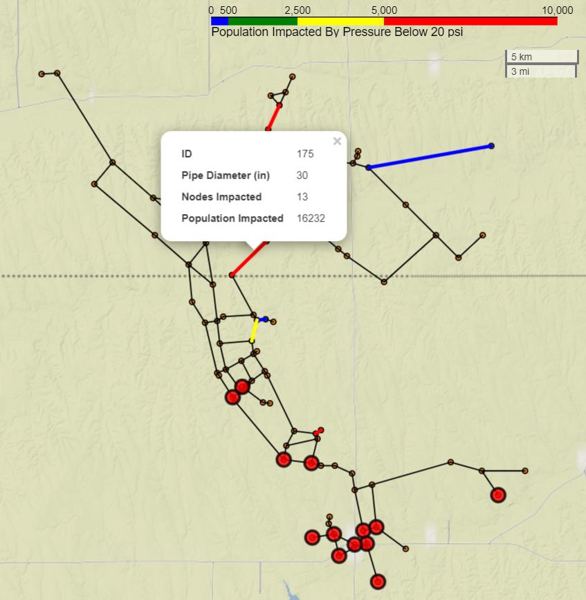

CriticalityMaps
---------------
CriticalityMaps is a [WNTR](https://github.com/USEPA/WNTR)-based utility for running large sets of 
fire, pipe, or custom criticality simulations and visualizing the results on
interactive leaflet.js html maps.  

Additionally, the mapping utilities can be used to visualize any other attributes of the network on an interactive .html map. 

Funding Disclaimer
------------------
The U.S. Environmental Protection Agency (EPA) through its Office of Research and Development funded and collaborated in the research described herein under Interagency Agreement (IA #92432901) with the Department of Energy’s Oak Ridge Associated Universities (ORAU).
